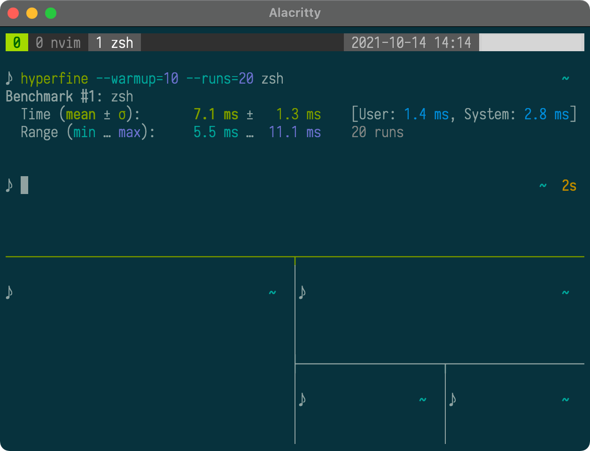

<h1 align="center">pbar's dotfiles</h1>
<h3 align="center">~ is where the ⚙ is</h3>

<p align="center">
  
  
  
  
  
</p>

<p align="center">
  
</p>

## Try it out!

You can demo my dotfiles by launching a shell in a throwaway container with this command:

```sh
docker run --rm -ith pbar-dotfiles ghcr.io/pbar1/dotfiles
```

Try things, like running `base16_<tab>` to change the shell theme!

## Dependencies

- `git`
- `zsh`
- `starship`

## How it was created

```bash
git init --bare "${HOME}/.config/dotfiles.git"
alias dotfiles="git --git-dir=${HOME}/.config/dotfiles.git --work-tree=${HOME}"
dotfiles config --local status.showUntrackedFiles no
dotfiles remote add origin git@github.com:pbar1/dotfiles.git
```

## How to clone

Checkout will refuse to overwrite existing files, so make sure to delete any first. From your home directory,

```bash
alias dotfiles="git --git-dir=${HOME}/.config/dotfiles.git --work-tree=${HOME}"
git clone --bare --recurse-submodules --jobs=8 https://github.com/pbar1/dotfiles.git "${HOME}/.config/dotfiles.git"
dotfiles checkout
```

## Rationale & Components

This is a [bare git repo][1] in my home directory for tracking dotfiles. It conforms to the [XDG directory standard][2].

Here are the components:
- Terminal: [Alacritty](https://github.com/alacritty/alacritty)
- Terminal multiplexer: [tmux](https://github.com/tmux/tmux)
  - Plugin manager: [tpm](https://github.com/tmux-plugins/tpm)
- Shell: [Zsh](https://www.zsh.org/)
  - Plugin manager: [Zinit](https://github.com/zdharma/zinit)
- Prompt: [Starship](https://starship.rs/)
- Editor: [Neovim](https://neovim.io/)

### Terminal

Alacritty was chosen as the terminal for its simplicity and cross-platform support, as well as its performance. It supports Linux and macOS, the main operating systems I use.

tmux was chosen as the terminal multiplexer for its configurability and to augment Alacritty (which does not have tabs/windows).

### Shell

Zsh was chosen as the shell for its wealth of features, community supported plugins that extend its usability, and POSIX compliance. Zinit (despite a rather unfriendly syntax and high amount of complexity) was chosen as the plugin manager to use with Zsh due to its extreme speed and expressiveness.

Starship was chosen as the prompt for simple configuration. It also works on many different shells, making the prompt easily portable.

### Aliases & Functions

Custom functions are kept in `~/.local/bin` as executable programs. This reduces dependence on a specific shell's features, allows use of other languages (ie, Python), and improves shell loading time (as they're just programs on the PATH).

Aliases are kept in `~./config/sh/aliases.sh` and are kept POSIX-compliant for reusability.

Abbreviations (enabled via a Zsh plugin) are kept in `~/.config/zsh/abbreviations`, and only work when using Zsh.

## TODO

- [ ] [Ignore][3] changes due to toggling (`starship toggle kubernetes`)
- [ ] Install script

<!-- References -->

[1]: https://news.ycombinator.com/item?id=11071754
[2]: https://wiki.archlinux.org/index.php/XDG_Base_Directory
[3]: https://stackoverflow.com/questions/6557467/can-git-ignore-a-specific-line
[4]: https://arslan.io/2021/02/15/automatic-dark-mode-for-terminal-applications/
[5]: https://www.reddit.com/r/neovim/comments/mehcyt/sync_neovim_background_with_macos_dark_mode/
[6]: https://docs.google.com/presentation/d/1HOLKb63i-aXNLug5hZsH9QIYxifn2ak-YQf2gRD7jII
